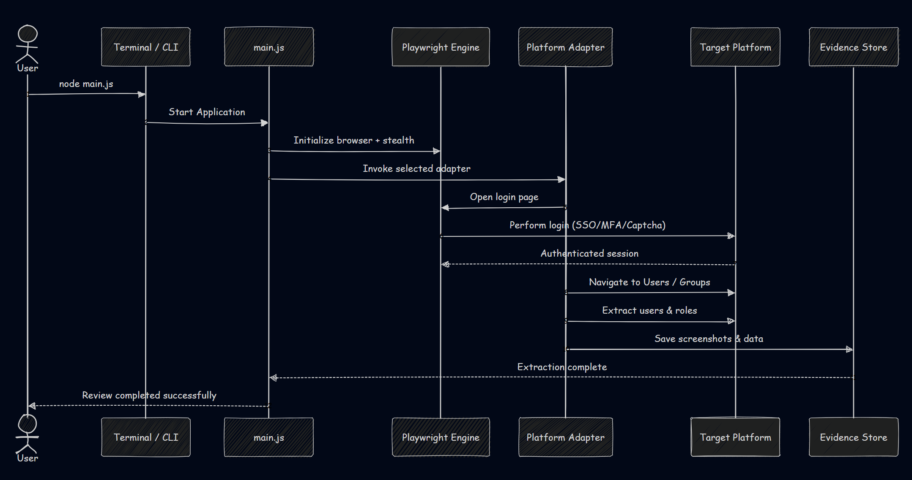
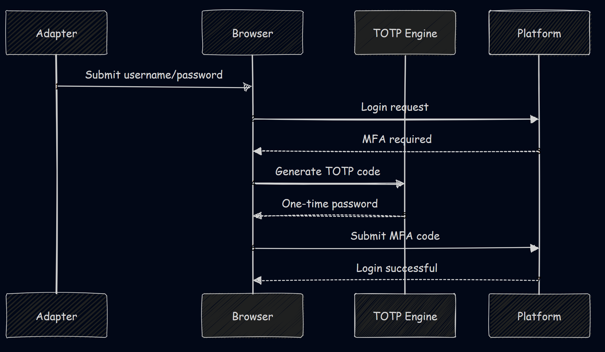
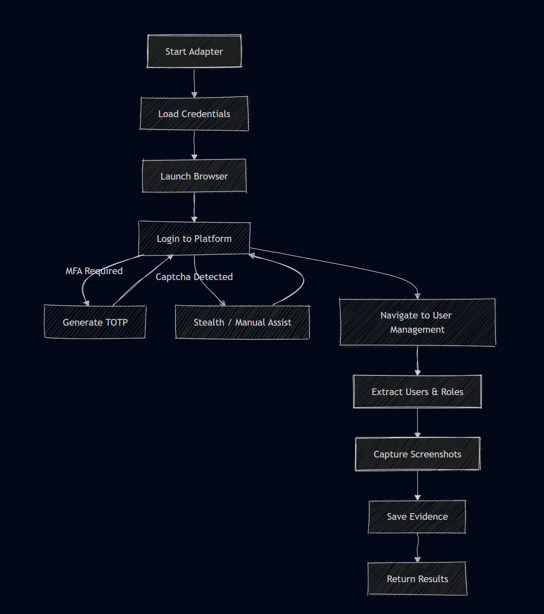
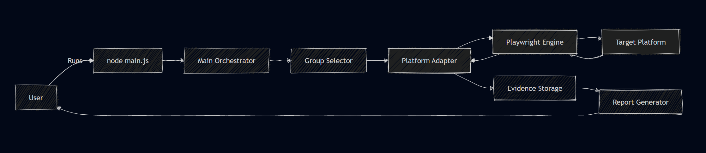
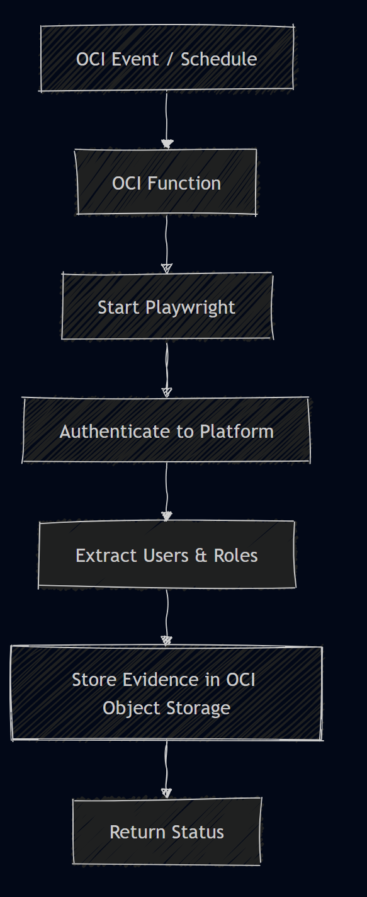

# 🛡️ Automate Access Review Suite (AARS)


---

##  What Is This Project?

**Automate Access Review Suite (AARS)** is an **enterprise-grade security automation tool** designed to perform **User Access Reviews (UAR)** across multiple SaaS and cloud platforms.

In simple terms:

>  *This tool logs into secured platforms the same way a human would, collects who has access to what, and produces audit-ready evidence automatically.*

It replaces **manual screenshots, CSV exports, and human error** with **repeatable, scriptable, and compliant automation**.

---

##  Why This Exists (Problem Statement)

Security and compliance teams are required to periodically answer questions like:

- Who has access to this system?
- What roles do they have?
- Has anyone gained or lost access since the last review?
- Can you prove it with screenshots?

Manually doing this:
- Is slow 
- Is error-prone 
- Does not scale 
- Burns engineers & auditors 

**AARS solves this by automating everything.**

---
##  System Architecture

### How to Read These Diagrams (Non-Technical)

* Rectangles → Actions

* Diamonds → Decisions

* Arrows → Flow direction

* Left → Right → Data movement

* Top → Bottom → Time progression

If you can follow arrows, you can understand this system.

```text
┌──────────────┐
│   main.js    │  ← Entry point / Orchestrator
└──────┬───────┘
       │
       ▼
┌─────────────────────┐
│ Platform Adapters   │  ← cloudflare.js, slack.js, etc.
│ (Login + Extract)   │
└──────┬──────────────┘
       │
       ▼
┌─────────────────────┐
│ Playwright Engine   │  ← Browser, stealth, MFA, captcha
└──────┬──────────────┘
       │
       ▼
┌─────────────────────┐
│ Evidence & Reports  │  ← Screenshots, diffs, summaries
└─────────────────────┘

```
##  High-Level Execution Flow (Sequence Diagram)


## Authentication Flow (MFA + Bot Detection)


## Adapter Lifecycle Flowchart


## Full System Flowchart


##  Core Design Philosophy

### Adapter-Based Architecture

Each platform (Cloudflare, Slack, OCI, etc.) has its **own adapter file**.

Why?
- Each platform has **unique login flows**
- Different MFA types
- Different UI structures

Adapters allow:
- Isolation of complexity
- Easy addition of new platforms
- Clean, maintainable code

---

### Browser-First Automation (Not APIs)

Many enterprise platforms:
- Block APIs
- Restrict audit permissions
- Detect bots

AARS **acts like a real human using a browser**, using:
- Playwright
- Stealth techniques
- Headed mode when required

---

## Project Structure

```text
Automate_Access_Review/
│
├── main.js                 # Central Orchestrator
├── playwright/
│   └── index.js            # Core Engine & Stealth Logic
│
├── adapters/               # Platform-Specific Logic
│   ├── cloudflare.js
│   ├── slack.js
│   ├── oci.js
│   ├── crowdstrike.js
│   └── jumpcloud.js
│
├── groupSelector.js        # CLI for targeted auditing
├── report.js               # Data aggregation & formatting
├── evidence/               # Storage for captured screenshots
├── .env                    # Secrets & Credentials (Ignored by Git)
└── package.json            # Project dependencies

```

---

##  File-by-File Explanation 

---

## `main.js` — The Brain (Orchestrator)

**What it does:**
- Entry point of the application
- Controls the entire access review workflow

**Responsibilities:**
- Loads environment variables
- Initializes Playwright
- Prompts user to select platforms/groups
- Calls the correct platform adapter
- Triggers evidence capture
- Triggers report generation

**Think of it as:**
> *The movie director — it doesn’t act, it tells everyone else what to do.*

---

##  `playwright/index.js` — Browser Engine & Stealth Layer

**What it does:**
- Sets up the browser (Chromium)
- Applies stealth configurations
- Controls headless vs headed mode

**Key Responsibilities:**
- User-agent spoofing
- Navigator property masking
- Timing randomization
- Window sizing
- Captcha/Turnstile handling hooks

**Why this matters:**
Most enterprise platforms **detect automation instantly**.  
This file exists purely to **look human**.

---

##  Platform Adapters (`cloudflare.js`, `slack.js`, etc.)

Each adapter follows the same **3-phase structure**:

### Authentication Phase
- Login via email/password
- Handle SSO redirects
- Inject MFA codes
- Bypass captchas if present

### Navigation Phase
- Navigate to:
  - Members page
  - User management page
  - Groups/roles section

### Extraction Phase
- Scrape:
  - Usernames
  - Emails
  - Roles
  - Groups
- Capture screenshots as evidence

---

### Example: `cloudflare.js`

**Special capabilities:**
- Turnstile captcha bypass
- Coordinate-based clicking
- Org-wide member enumeration

**Why it’s special:**
Cloudflare has **aggressive bot detection** — this adapter is optimized for stealth.

---

### Example: `slack.js`

**Special capabilities:**
- JumpCloud SSO handling
- TOTP MFA injection
- Enterprise Grid navigation

---

### Example: `oci.js`

**Special capabilities:**
- IAM-based authentication
- Group-specific user extraction
- Role visibility validation

---

## `groupSelector.js` — Interactive CLI Tool

**What it does:**
- Prompts user in terminal
- Allows selection of:
  - Specific groups
  - Full org review
  - Targeted audits

**Why it exists:**
Not every audit needs *everything*.

This keeps reviews:
- Focused
- Faster
- Cleaner

---

## `report.js` — Audit Summary Generator

**What it does:**
- Aggregates extracted data
- Compares previous runs
- Generates delta reports

**Key Features:**
- User added / removed detection
- Role changes
- Group membership changes

This is what auditors actually care about.

---

## Evidence Management (`/evidence`)

Evidence is stored as:

```test
evidence/
└── cloudflare/
├── 2024-10-21_10-30.png
└── 2024-10-21_10-31.png
```

**Why screenshots matter:**
- Screenshots are **non-repudiable**
- Required for SOC2, ISO27001, SOX
- Proves the review actually happened

---

## MFA Automation (TOTP)

This project uses:
- `otplib`

**Flow:**
1. Reads MFA secret from `.env`
2. Generates real-time TOTP
3. Injects code into MFA prompt

**No SMS. No human intervention.**

---

## Headed vs Headless Logic

| Scenario | Mode |
|--------|------|
| Simple login | Headless |
| MFA / Captcha | Headed |
| Bot-sensitive platforms | Headed |
| Background scraping | Headless |

This hybrid approach maximizes:
- Success rate
- Speed
- Reliability

---

## Installation & Setup

```bash
git clone https://github.com/Praise-paul/Automate_Access_Review.git
cd Automate_Access_Review
npm install
npx playwright install chromium

```

## Environment Variables (.env)
```bash
CLOUDFLARE_EMAIL=
CLOUDFLARE_PASSWORD=
CLOUDFLARE_MFA_SECRET=

JUMPCLOUD_EMAIL=
JUMPCLOUD_PASSWORD=
JUMPCLOUD_MFA_SECRET=

```
##  Running the tool
```code
node main.js
```

## Running the Suite on Serverless Platforms (AWS Lambda & OCI Functions)

Although this project is primarily designed for local or VM-based execution, it **can be adapted to run on serverless platforms** with some important considerations.

> **Important:** Browser-based automation is resource-intensive and not a natural fit for serverless.  
> This section explains *how to make it work* and *when it makes sense*.

---

## When Serverless Makes Sense

Use Lambda / Functions when:
- You want **scheduled access reviews**
- You want **on-demand execution**
- You don’t need long-running sessions
- You can tolerate cold starts

Avoid serverless when:
- Reviews exceed 10–15 minutes
- Manual interaction is frequently required
- Platforms aggressively block automation

---

## AWS Lambda Deployment (Playwright + Chromium)

###  Key Constraints

| Constraint | Impact |
|---------|------|
| Execution time | Max 15 minutes |
| No native GUI | Requires virtual display |
| Limited disk | Evidence must be uploaded to S3 |
| Cold start | Browser startup delay |

---

### Required Components

- **Lambda Runtime:** Node.js 18+
- **Playwright Chromium (headless)**
- **Xvfb (Virtual Display)**
- **Custom Lambda Layer** for Chromium

---

### Why Xvfb Is Required (Cloudflare)

Cloudflare access reviews **require headed browser execution** due to:
- Turnstile challenges
- Coordinate-based clicking
- UI-sensitive detection

**AWS Lambda has no display server by default**

Solution: **Xvfb (X Virtual Frame Buffer)**

> Xvfb simulates a display so Playwright can run in “headed” mode inside Lambda.

---

### Lambda Execution Flow


### Example Lambda Bootstrap Script

```bash
Xvfb :99 -screen 0 1280x720x24 &
export DISPLAY=:99
node main.js
```

### Xvfb on OCI Functions

```bash
yum install -y xorg-x11-server-Xvfb
Xvfb :99 &
export DISPLAY=:99
node main.js

```

### OCi Functions Flow


### Best Practices

* Use EventBridge / OCI Scheduler for periodic reviews

* Store credentials in AWS Secrets Manager or OCI Vault

* Export reports to S3 / OCI Object Storage

* Keep execution under 10 minutes

## How to Add a New Platform

**Create a new adapter file**

* Implement:
1. login()
2. navigate()
3. extract()

* Register it in main.js

## Author

**Praise Paul**

Security Automation & Offensive Engineering
